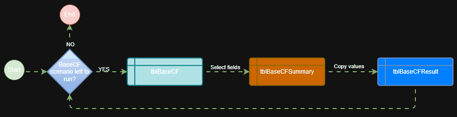

# CASHFLOW ILLUSTRATION FOR UNIVERSAL LIFE AND INVESTMENT LINK PRODUCT SPREADSHEET

## About The Project

### Intro

The project is an Excel file powered with Office Script for speed of execution and cross platform feature. The file acts as a versatile tool to generate materials that are used to make actual insurance sales materials.

If you are an actuary, consider this as an open-source that make your small tasks a lot easier.

Further more, if you need a full translation to sytem OOP to deal with IT or 3rd parties, please visit [https://github.com/hnlearndev/Universal-Life-Investment-Link-Cashflow-Illustration-Rust.git](https://github.com/hnlearndev/Universal-Life-Investment-Link-Cashflow-Illustration-Rust.git)

### Obstacles

- Although being simple in its nature, yet the task is sufficiently complex once involved with different parties.
Eventually, an actuary might cross to the field of IT or Agency practises to deliver his/her solution on such a small and niche topic.
- A vast differences between developing and developed market place emphasis on the task importance. In developing market, building things from the ground up creates an entirely different challenge set.
- A single issue will escalate at speed of light and sizable impact. Many regulation problems usually comes from this. Especially in developing markets.

### Purposes

- The tool is consolidated with the most versatile solution possible for Universal Life and Investment Link Product illustration.
- The tool acts as a backbone for system implementation: demo calculations, product features, sometimes supports special cases during actual sales process that are limited by system presets.
  
More discussion on implementation can be found at [Empty]()

## Structure

## Getting started

- Require Excel version that has Office Script automate feature.
- Office Script is capable of running cross-platform. In another word, unlike VBA which must run locally, this will work as long as there is an internet. However run speed online will be slower than running locally. Script is also speedier than VBA running locally.
- Excel Online can also add a layer of security by deciding who can access the file, as well as who can access the script.
- The script is provided as *ilp_uvl_unified.ts* for your reference.

## Roadmap

- Add Changelog
- Build a Power Automate to generate pdf/sales materials.
- Build a Office Add-In to generate complete pdf/sales materials.
- Multi-language Support: Chinese, Spanish

## Contact

Trung-Hieu Nguyen - [hieunt.hello@gmail.com](mailto:hieunt.hello@gmail.com)

Project Link: [https://github.com/hnlearndev/Universal-Life-Investment-Link-Cashflow-Illustration-Excel-SpreadSheet.git](https://github.com/hnlearndev/Universal-Life-Investment-Link-Cashflow-Illustration-Excel-SpreadSheet.git)
